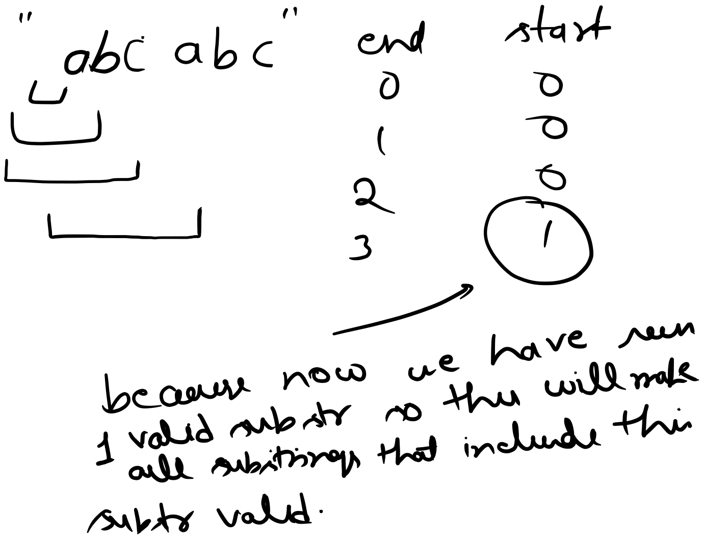

# 1358. Number of Substrings Containing All Three Characters

### Question Link



### Solution



```python
class Solution:
    def numberOfSubstrings(self, s: str) -> int:
        is_valid = lambda x: all(x[char] > 0 for char in "abc")
        window = Counter()
        result = 0
        start = 0
        for end, char in enumerate(s):
            window[char] += 1
            
            while is_valid(window):
                window[s[start]] = max(window[s[start]]-1, 0)
                start += 1
            result += start
        return result
```
