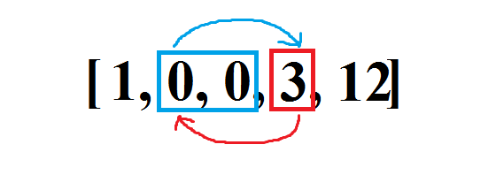

# 1650. Lowest Common Ancestor of a Binary Tree III

### Question Link



### Solution

Its same as trying to find the intersection point of two linked lists.



```python
def solve(p, q):
    temp_p = p
    temp_q = q
    while  p is not q:
        p = temp_q if p is None else p.parent
        q = temp_p if q is None else q.parent
    return q
```

### Similar


[160.-intersection-of-two-linked-lists.md](../linked-list/160.-intersection-of-two-linked-lists.md)

